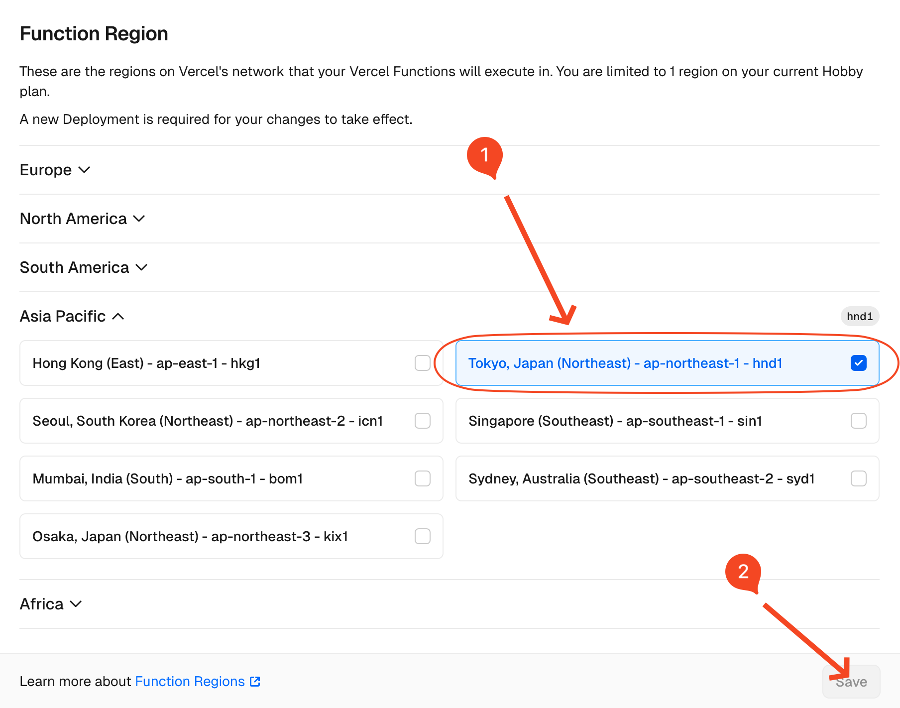

# dlsite-proxy

[DLsite](https://www.dlsite.com) 近期限制了非日本IP访问部分作品，导致这些作品无法被 [Kikoeru](https://github.com/vscodev/kikoeru) 刮削，本项目旨在提供一个曲线救国的方法以解决此问题。

## 使用

将本项目部署到你的Vercel并更改Function Region为日本，如下图所示：

设置 `KIKOERU_DLSITE_PROXY` 环境变量为本项目的Vercel地址然后重启Kikoeru即可，如 `https://dlsite-proxy.vercel.app` 。
